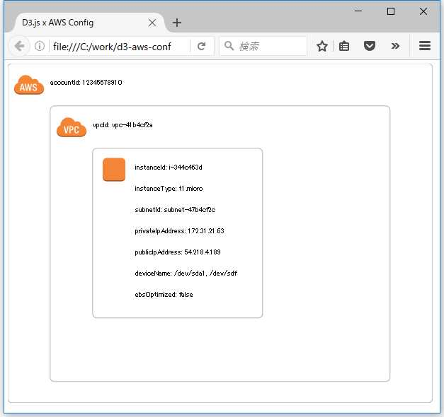

# AWSのシステム構成をD3.jsで可視化する
<p align="right">
  
</p>
---
<div style="text-align: right;">加納　邦彦</div>

## はじめに

　クラウドサービスの導入が進み、インフラ調達は劇的に楽になりました。その一方で、経験豊富であればあるほど、インフラ設計や各種評価のやり方については、従来と同様な手法を踏襲するケースが多いと思います。

| 主なタスク               | 成果物のフォーマット例  |
| ------------------------ |:-----------------------:|
| 提案                     | PowerPoint              |
| 要件定義、概要設計       | Word、Excel             |
| 詳細設計、パラメータ設計 | Word、Excel             |
| 試験計画／試験項目表     | Word、Excel             |
| 物理／論理／NW構成図等   | Visio                   |
| 各種評価レポート／報告書 | PowerPoint、Word、Excel |

* 「クラウドを使えば、早く・安く・うまく、システムを構築できます。」
* 「クラウドなので、スケールアップ／スケールアウト等、サーバ構成の変更は柔軟に対応できます。」
* 「豊富な経験から制定した社内ルールに従って、しっかり設計・試験をするので、品質はお任せください。」

と売り込むのはいいのですが、従来型のSIerサービスの手厚い成果物の修正は、クラウドサービスほど柔軟に対応できません。

* コピペと人海戦術による対応にも限度があります。
* ドキュメントの反映漏れや修正ミスにより、実環境が最新という状態はあります。
* セキュリティ意識が高いと実環境を気軽に触れない／情報を持ち出せないこともあります。

　ここはやはり、クラウドサービスを有効活用するべきでしょう。

## AWS Config とは

　AWS公式の[AWS Config](https://aws.amazon.com/jp/config/) のページによると、「AWS Config は完全マネージド型のサービスで、セキュリティとガバナンスのため、AWS リソースインベントリ、設定履歴、および設定変更通知といった機能が用意されています。」とあります。AWSリソースの構成や設定変更の履歴を監査・可視化することが出来ます。

　以下のような構成情報をJSON形式で取得することができます。

```json:aws_config.json
{
    "fileVersion": "1.0",
    "requestId": "asudf8ow-4e34-4f32-afeb-0ace5bf3trye",
    "configurationItems": [
        {
            "configurationItemVersion": "1.0",
                    <中略>
            "accountId": "12345678910",
                    <中略>
            "availibilityZone": "us-west-2b",
            "resourceType": "AWS::EC2::Instance",
                    <中略>
            "configuration": {
                "instanceId": "i-344c463d",
                "imageId": "ami-ccf297fc",
                    <中略>
                "instanceType": "t1.micro",
                    <中略>
                "vpcId": "vpc-41b4cf2a",
                "privateIpAddress": "172.31.21.63",
                "publicIpAddress": "54.218.4.189",
                "architecture": "x86_64",
                "rootDeviceType": "ebs",
                "rootDeviceName": "/dev/sda1",
                　　<中略>
            }
        }
    ]
}
```

> AWS Config
> https://aws.amazon.com/jp/config/

> AWS再入門 AWS Config編
> http://dev.classmethod.jp/cloud/aws/cm-advent-calendar-2015-aws-re-entering-aws-config/

> AWS Configを使ったAWS環境の見える化
> http://www.slideshare.net/morisshi/develipersio-2016-e1-aws-configaws

　AWS Configの対応サービスの制約等により、要件を満たせない場合は、AWS CLI（コマンドラインインターフェイス）から取得したAWS各種サービスの情報をjq（JSONパーサー）で加工することもできます。

> AWS コマンドラインインターフェイス
> https://aws.amazon.com/jp/cli/

> AWS Black Belt Tech シリーズ 2015 AWS CLI & AWS Tools for Windows Powershell
>  http://www.slideshare.net/AmazonWebServicesJapan/aws-black-belt-tech-2015-aws-cloudtrail-aws-sdk-for-powershell

> jq
> https://stedolan.github.io/jq/

> 軽量JSONパーサー『jq』のドキュメント：『jq Manual』をざっくり日本語訳してみました
> http://dev.classmethod.jp/tool/jq-manual-japanese-translation-roughly/

## AWS Config Partner について

　AWS Config Partnerに登録されている有料のサービスを活用することもできます。

> AWS Config Partners
> https://aws.amazon.com/config/partners/

> Logstorage連携パック for AWS Config
> http://www.logstorage.com/welcome/awsconfig_pack.html

> LogstorageでAWSの全体構成を可視化する
> http://dev.classmethod.jp/cloud/aws/aws-logstorage-config/

　ただ、有料のサービスのため、個人利用では気軽に試しにくいと思います。また、商用利用であっても、AWSサービス利用料以上の金額をその他の付加サービスにかけるのは抵抗があるケースも多いと思います。そのため、今回はD3.jsで可視化を試みます。

## D3.js について

　[D3.js](https://d3js.org/) は、JavaScriptの可視化ライブラリです。CSVやJSON形式のデータを読み込み、HTMLやSVG形式で可視化をすることができます。

```
// CSV形式を読み込む
d3.csv("test.csv", function(error, data){
    var text = "";
    for(var i=0; i<data.length; i++){
       console.log(data);
    }
});

// JSONを読み込む
d3.json("test.json", function(error, data){
    for(var i=0; i<data.length; i++){
        console.log(data);
    }
});
```

　Excelから出力したCSV形式やAWS ConfigやAWS CLI等のAWSのサービスから取得したJSON形式のデータと連携するのは、難しくありません。

> D3 gallery
> https://github.com/d3/d3/wiki/Gallery

> D3.js例文辞典
> http://www.openspc2.org/reibun/D3.js/

## AWS Configのサンプルデータ について

　AWS Configのスナップショットのサンプルは以下から取得しました。

> Example Configuration Snapshot from AWS Config
> http://docs.aws.amazon.com/ja_jp/config/latest/developerguide/example-s3-snapshot.html

## AWSのアイコン について

　AWSのアイコンは以下から取得しました。

> AWS Simple Icons for Architecture Diagrams
> https://aws.amazon.com/jp/architecture/icons/

## ディレクトリ構成 について

　今回用意する資材は、以下のディレクトリ構成とします。

```
C:\work\d3-aws-config
│  index.html
│  
├─images
│  └─AWS_Simple_Icons_EPS-SVG
│      ├─Compute
│      │      Compute_AmazonEC2_instance.svg
│      │      
│      └─General
│              General_AWScloud.svg
│              General_virtualprivatecloud.svg
│              
└─json
        aws_config.json

```

## AWS ConfigをD3.jsで可視化した例 について

　以下が表示例です。動作確認は、FireFoxでしました。



## Google Chromeで表示する場合の注意点 について

　jsonの読み込みに「file://」を使っているため、Google Chromeでは以下の警告が出力され、ローカルのファイルを開くことができません。

```
d3.v3.min.js:1 XMLHttpRequest cannot load file:///C:/work/d3-aws-config/json/aws_config.json. Cross origin requests are only supported for protocol schemes: http, data, chrome, chrome-extension, https, chrome-extension-resource.
```

　コマンドプロンプトを「管理者として実行」し、「--allow-file-access-from-files」オプションをつけることで表示できると思います。

```
"C:\Program Files (x86)\Google\Chrome\Application\chrome.exe" --allow-file-access-from-files C:\work\d3-aws-config\index.html
```

## サンプルコード について

　[GitHub](https://github.com/lvisdd/d3-aws-config) で公開しています。サンプルコードは、ご自由にお使いください。お試しで作ったものなので、利用には注意してください。

> d3-aws-config
> https://github.com/lvisdd/d3-aws-config

## おわりに

　デスマーチは大規模案件だけではありません。スケジュール／コスト感／手法が全く異なるにも関わらず、大規模案件と同レベルの品質担保（という名のドキュメント作成地獄）を求められる小規模案件にも罠はたくさん潜んでいます。

* クラウドサービスでできることは、極力サービス側に任せる。
* コスト見合いで商用サービスと連携する。
* 必要な場合のみ顧客／運用要件に合わせて作りこむ。
* 作りこみはその場限りにならないようにする。
* ドキュメントのコピペと人海戦術の修正は効率化とは言わない。

等の工夫により、クラウド型のデスマーチを回避するヒントになれば幸いです。
